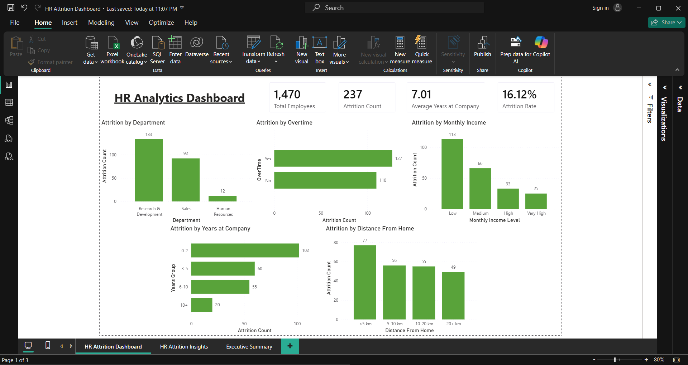
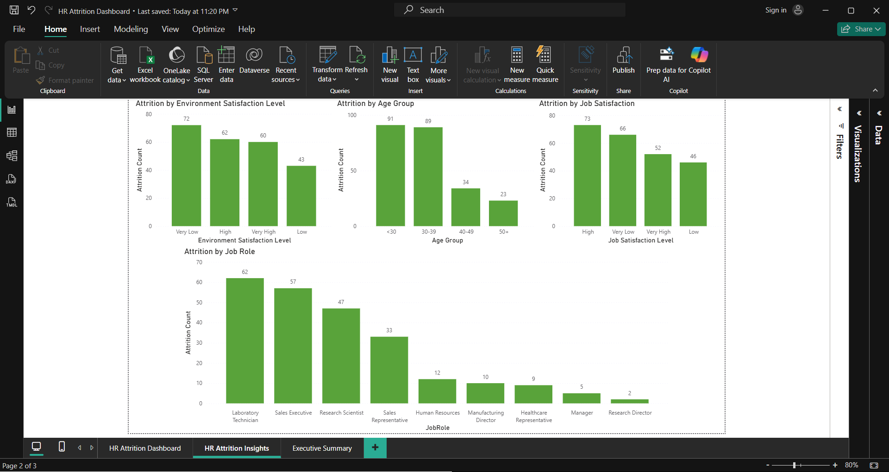
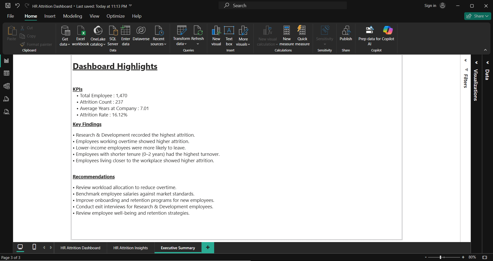

# HR Attrition Dashboard (Power BI)

## Overview

This project analyzes employee attrition to identify the key factors contributing to employee turnover. The dashboard provides interactive visualizations to help HR teams understand attrition patterns and support data-driven decision-making.

---

## Objectives

- Analyze employee attrition patterns
- Identify departments with the highest employee turnover
- Evaluate the impact of overtime, salary, tenure, business travel, and employee satisfaction
- Support HR decision-making through interactive dashboards

---

## Dashboard Pages

### 1. HR Attrition Dashboard

Provides a high-level overview of employee attrition with key performance indicators and major business drivers.

**KPIs**

- Total Employees
- Attrition Count
- Average Years at Company
- Attrition Rate

**Visualizations**

- Attrition by Department
- Attrition by Overtime
- Attrition by Monthly Income
- Attrition by Years at Company
- Attrition by Distance From Home

---

### 2. HR Attrition Insights

Provides deeper analysis of employee characteristics associated with higher attrition.

**Visualizations**

- Attrition by Environment Satisfaction
- Attrition by Job Satisfaction
- Attrition by Age Group
- Attrition by Job Role

---

### 3. Executive Summary

**Key Findings**

- Research & Development recorded the highest attrition.
- Employees working overtime showed higher attrition.
- Lower-income employees were more likely to leave.
- Employees with shorter tenure (0–2 years) had the highest turnover.
- Employees living closer to the workplace showed higher attrition.

**Recommendations**

- Review workload allocation to reduce overtime.
- Benchmark employee salaries against market standards.
- Improve onboarding and retention programs for new employees.
- Conduct exit interviews for Research & Development employees.
- Review employee well-being and retention strategies.

---

## Tools Used

- Microsoft Power BI
- Microsoft Excel
- DAX

---

## Dataset

This project was built using the **IBM HR Analytics Employee Attrition & Performance** dataset.

- **Original Dataset**: [IBM HR Analytics Attrition Dataset](https://www.kaggle.com/datasets/pavansubhasht/ibm-hr-analytics-attrition-dataset) by Pavan Subhash
- **License**: Database: Open Database License (ODbL) | Contents: Database Contents License

This is a **fictional** dataset created by IBM data scientists for educational and analytical purposes.

This repository is shared for **educational and portfolio purposes only**. The original dataset is not included as a separate CSV file in this repository. The dataset can be obtained from the original Kaggle source linked above.

---

## Dashboard Preview

### HR Attrition Dashboard

### HR Attrition Insights

### Executive Summary

---

## Author

**Nico Pradipta Gunawan**
